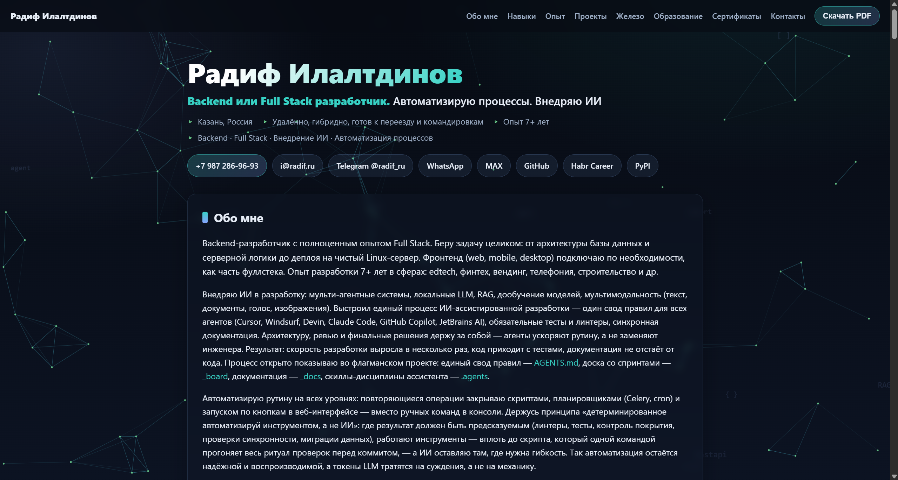

# radif.ru — персональный сайт и резюме

[](https://github.com/radif-ru/www/actions/workflows/ci.yml)
[](https://radif.ru)
[](./LICENSE)
[](https://github.com/radif-ru/www/commits)
[](https://github.com/radif-ru/www/issues)


Исходный код персонального сайта-резюме [radif.ru](https://radif.ru) — живой пример Full Stack
и DevOps под ключ. Главная страница (`index.html`) — резюме; стили и скрипты вынесены в `assets/`
(`style.css`, `app.js` на нативном ES6), структурированные данные (JSON-LD `@graph`) встроены
в `<head>`. Разворачивается в Docker за Nginx.



## Возможности

- **Frontend:** семантический HTML5, доступность (skip-link, ARIA-лендмарки, навигация с
  клавиатуры), адаптивная вёрстка на нативном CSS (переменные, `clamp()`, Grid, вложенность) и
  фоновая canvas-анимация «нейросети» на нативном JavaScript (ES6) с учётом энергосбережения и
  `prefers-reduced-motion`.
- **SEO:** OpenGraph / Twitter Cards, canonical, `robots.txt`, `sitemap.xml`, расширенный JSON-LD
  (`@graph`: `Person`, `WebSite`, `ProfilePage`, `SoftwareSourceCode`).
- **PWA:** `manifest.webmanifest`, SVG-фавиконка и иконки 192/512 (в т.ч. maskable), `theme-color`.
- **DevOps:** Docker + Nginx, TLS 1.2/1.3, HTTP/2 (`http2 on;`), строгий Content-Security-Policy
  (`script-src 'self'`), security-заголовки, gzip, кэш-заголовки, healthcheck.
- **Качество:** Prettier, ESLint, Stylelint, html-validate и CI на GitHub Actions (+ Lighthouse).

## Связанный репозиторий

Этот репозиторий используется вместе с
[radif-ru/linux-settings](https://github.com/radif-ru/linux-settings) —
там хранятся настройки рабочего окружения Linux. Каталог `www` в `linux-settings`
соответствует содержимому данного репозитория (`radif-ru/www`).

## Структура

- `index.html` — главная страница-резюме.
- `assets/` — вынесенные стили (`style.css`) и скрипты (`app.js`, ES6).
- `manifest.webmanifest`, `favicon.svg`, `icon-*.png` — PWA-манифест и иконки.
- `robots.txt`, `sitemap.xml` — файлы для поисковых систем.
- `files/` — файлы сайта (изображения, документы).
- `etc/nginx/` — конфигурация nginx для продакшена.
- `Dockerfile`, `docker-compose.prod.yml` — сборка и деплой.
- `package.json`, `.stylelintrc.json`, `eslint.config.mjs`, `.htmlvalidate.json`,
  `.prettierrc.json`, `.editorconfig` — инструменты качества кода.
- `.github/workflows/ci.yml`, `lighthouserc.json` — CI (линтеры + Lighthouse).
- Подмодули — отдельные pet-проекты.

> **Деплой:** прод в `docker-compose.prod.yml` монтирует конкретные файлы/папки в
> `/var/www`. Каталог `assets/`, `robots.txt`, `sitemap.xml`, `manifest.webmanifest`,
> `favicon.svg` и `icon-*.png` уже добавлены в тома nginx — при добавлении новых внешних
> ассетов не забудьте примонтировать их и **пересоздать** контейнер
> (`docker compose -f docker-compose.prod.yml up -d`, а не reload).

## Разработка и качество кода

```bash
npm install         # установить dev-зависимости
npm run lint        # Stylelint (CSS) + ESLint (JS) + html-validate (HTML)
npm run format      # автоформатирование конфигов/доков (Prettier)
npm run format:check
```

Локальный предпросмотр статики (сборка не нужна):

```bash
npx --yes http-server . -p 8080 -c-1
# затем открыть http://localhost:8080/
```

Хендмейд-файлы сайта (`index.html`, `assets/style.css`, `assets/app.js`) намеренно
отформатированы вручную и добавлены в `.prettierignore`, поэтому Prettier их не трогает.
CI на GitHub Actions (`.github/workflows/ci.yml`) прогоняет те же линтеры и Lighthouse
на каждый push и pull request.

## Git-подмодули

Некоторые проекты подключены как git-подмодули (см. `.gitmodules`).
Каждый подмодуль — самостоятельный репозиторий, а в этом репозитории фиксируется
лишь ссылка на конкретный коммит. Все подмодули публичные и тянутся по HTTPS,
кроме `pro-gidroizolyaciya` (приватный, NDA, SSH).

| Подмодуль                                                                                | Краткое описание                                                                                                                                                                                                                                                                                                                                                      |
| ---------------------------------------------------------------------------------------- | --------------------------------------------------------------------------------------------------------------------------------------------------------------------------------------------------------------------------------------------------------------------------------------------------------------------------------------------------------------------- |
| [Django_optimization_tools](https://github.com/radif-ru/Django_optimization_tools)       | Интернет-магазин на Django: Ajax, jQuery, собственная админка, регистрация через соцсети. Сервер: Python / Django / Nginx / Gunicorn. Запущен в режиме отладки с инструментами разработчика.                                                                                                                                                                          |
| [Full_Stack_Django_REST_React](https://github.com/radif-ru/Full_Stack_Django_REST_React) | Личный Full Stack проект: Django REST Framework (JWT, GraphQL, AsyncIO, Aiohttp, Contextvars, свои middleware, метаклассы, декораторы) + React (React Router, Axios, Redux). OpenAPI (Swagger/ReDoc), PostgreSQL, Gunicorn, Nginx, Docker Compose, деплой на VPS.                                                                                                     |
| [HTML-CSS-Base](https://github.com/radif-ru/HTML-CSS-Base)                               | Базовый курс HTML/CSS: лендинг и каталог.                                                                                                                                                                                                                                                                                                                             |
| [HTML-CSS-Prof](https://github.com/radif-ru/HTML-CSS-Prof)                               | Профессиональная вёрстка HTML/CSS: несколько макетов, адаптивная вёрстка.                                                                                                                                                                                                                                                                                             |
| [Intergalactic_Entertainment](https://github.com/radif-ru/Intergalactic_Entertainment)   | Командная разработка платформы по Agile/SCRUM: авторизация, публикации, CKEditor-редактор, ролевая модель (staff/user), загрузка изображений. Django, Docker Compose, Gunicorn, Nginx, SSL. Деплой на VPS.                                                                                                                                                            |
| `pro-gidroizolyaciya` _(приватный, NDA)_                                                 | Коммерческий сайт строительной компании — pro-gidroizolyaciya.ru (на текущий момент домен неактивен): full cycle — адаптивная вёрстка (mobile-first, кроссбраузерность), CSS-анимации, галерея работ, лидогенерация через форму заявок, PHP-обработка с экранированием ввода, деплой на Linux VPS в Docker Compose за Nginx с TLS 1.2/1.3 (Let's Encrypt), HSTS, CSP. |
| [JavaScriptProfessional](https://github.com/radif-ru/JavaScriptProfessional)             | Продвинутый JavaScript: сборка через Gulp/Bower, интерактивный интерфейс интернет-магазина.                                                                                                                                                                                                                                                                           |
| [JavaScriptProfessional-v2](https://github.com/radif-ru/JavaScriptProfessional-v2)       | Интернет-магазин на Vue.js 3 + Node.js: LocalStorage, Bootstrap, SASS, drag-and-drop корзина, автодополнение поиска. SPA без бэкенда.                                                                                                                                                                                                                                 |
| [html-css_interactive](https://github.com/radif-ru/html-css_interactive)                 | Интерактивный курс HTML/CSS на основе Bootstrap.                                                                                                                                                                                                                                                                                                                      |

### Клонирование вместе с подмодулями

```bash
git clone --recurse-submodules https://github.com/radif-ru/www.git
```

Если репозиторий уже склонирован:

```bash
git submodule update --init --recursive
```

### Обновление подмодулей до последних коммитов

```bash
git submodule update --remote --merge
```

## Лицензия

Исходный код сайта (разметка, стили, скрипты, конфигурация) — под лицензией **MIT**.
Текст резюме, персональные данные и материалы в `files/` — © Радиф Рашитович Илалтдинов,
использование только с разрешения автора.
