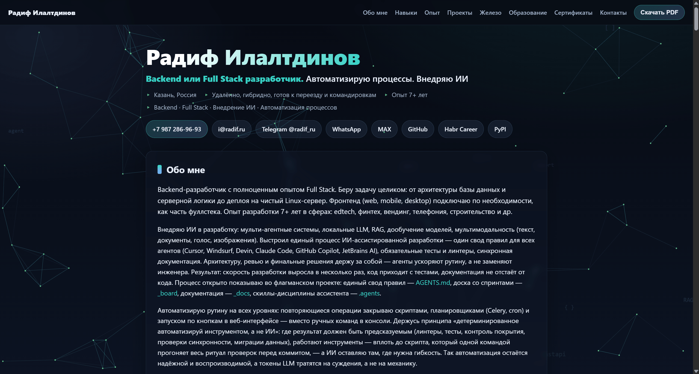

# radif.ru — персональный сайт и резюме

[](https://github.com/radif-ru/www/actions/workflows/ci.yml)
[](https://radif.ru)
[](./lighthouserc.json)
[](./.github/workflows/ci.yml)
[](./.prettierrc.json)
[](./eslint.config.mjs)
[](./.stylelintrc.json)
[](./.htmlvalidate.json)

[](https://html.spec.whatwg.org/)
[](https://developer.mozilla.org/docs/Web/CSS)
[](https://developer.mozilla.org/docs/Web/JavaScript)
[](https://developer.mozilla.org/docs/Web/API/Canvas_API)
[](https://schema.org/Person)
[](./manifest.webmanifest)
[](./Dockerfile)
[](./docker-compose.prod.yml)
[](./etc/nginx)
[](./etc/nginx)
[](./etc/nginx/acme)

[](#возможности)
[](./Dockerfile)
[](./package.json)
[](./etc/nginx)
[](#возможности)
[](#git-подмодули)
[](./LICENSE)

[](https://github.com/radif-ru/www/issues)
[](https://github.com/radif-ru/www)
[](https://github.com/radif-ru/www)

<details>
<summary>Какие бейджи обновляются автоматически</summary>

Живые: `CI` (статус пайплайна), `radif.ru` (доступность сайта), `issues`, `repo size`, `code size` — всё это shields.io запрашивает у GitHub при отрисовке.
Остальные статические: они фиксируют стек, принципы и текущие пороги (`CI checks`, `Lighthouse`,
`build step`, `runtime deps`, `submodules`), которые проверяются в CI или конфигами и меняются
вместе с кодом.

</details>

Исходный код персонального сайта-резюме [radif.ru](https://radif.ru) — не «страничка о себе»,
а рабочее доказательство компетенций: тот же цикл Full Stack + DevOps под ключ, что и в
продакшн-проектах, только целиком открытый. Главная страница (`index.html`) — само резюме;
стили и скрипты вынесены в `assets/` (`style.css`, `app.js` на нативном ES6), структурированные
данные (JSON-LD `@graph`) встроены в `<head>`. Ни фреймворков, ни сборщиков, ни CDN: в прод
уходят те же файлы, что лежат в репозитории — в Docker за Nginx, на моём VPS, с TLS 1.2/1.3,
HTTP/2 и строгим Content-Security-Policy.



## Показатели

| Показатель                   | Значение                                                                             | Чем подтверждается                                       |
| ---------------------------- | ------------------------------------------------------------------------------------ | -------------------------------------------------------- |
| Рантайм-зависимостей         | **0** — ни фреймворков, ни сборщиков, ни CDN                                         | [`package.json`](./package.json): только dev-инструменты |
| Шагов сборки                 | **0** — в прод уходят файлы из репозитория как есть                                  | [`Dockerfile`](./Dockerfile)                             |
| Внешних запросов на странице | **0** — нет ни шрифтов с CDN, ни аналитики, ни трекеров                              | CSP `script-src 'self'`, [`etc/nginx/`](./etc/nginx)     |
| Автоматических проверок в CI | **7** — Prettier, Stylelint, ESLint, html-validate, 2 гейта синхронности, Lighthouse | [`.github/workflows/ci.yml`](./.github/workflows/ci.yml) |
| Проверок в одном `preflight` | **7** до коммита, все детерминированные (без ИИ)                                     | [`scripts/preflight.sh`](./scripts/preflight.sh)         |
| Порог Lighthouse             | **≥ 90** по accessibility, SEO и best practices                                      | [`lighthouserc.json`](./lighthouserc.json)               |
| Объём кода сайта             | **~1,5 тыс. строк** — разметка, стили и скрипт целиком                               | [`index.html`](./index.html), [`assets/`](./assets)      |
| Схем JSON-LD в `@graph`      | **5** — `Person`, `WebSite`, `ProfilePage` и два `SoftwareSourceCode`                | [`index.html`](./index.html), `<head>`                   |
| Скриншотов демо в галерее    | **5** в WebP, ленивая загрузка по `IntersectionObserver`                             | [`files/screenshots/`](./files/screenshots)              |
| Подключённых pet-проектов    | **9** git-подмодулей                                                                 | [`.gitmodules`](./.gitmodules)                           |

## Возможности

- **Frontend:** семантический HTML5, доступность (skip-link, ARIA-лендмарки, навигация с
  клавиатуры), адаптивная вёрстка на нативном CSS (переменные, `clamp()`, Grid, вложенность) и
  фоновая canvas-анимация «нейросети» на нативном JavaScript (ES6) с учётом энергосбережения и
  `prefers-reduced-motion`.
- **Галерея демо:** раздел `#demo` со скриншотами мульти-агентной системы — превью
  подставляются из `data-src` только после события `load` и по `IntersectionObserver`,
  полные версии (WebP) грузятся по клику в лайтбокс с навигацией стрелками и `Esc`.
  На скорость первой отрисовки галерея не влияет.
- **SEO:** OpenGraph / Twitter Cards, canonical, `robots.txt`, `sitemap.xml`, расширенный JSON-LD
  (`@graph`: `Person`, `WebSite`, `ProfilePage`, `SoftwareSourceCode` + `ImageObject` скриншотов).
- **PWA:** `manifest.webmanifest`, SVG-фавиконка и иконки 192/512 (в т.ч. maskable), `theme-color`.
- **DevOps:** Docker + Nginx на собственном VPS, TLS 1.2/1.3, HTTP/2 (`http2 on;`), автопродление
  сертификатов Let's Encrypt, gzip, кэш-заголовки, healthcheck. Content-Security-Policy — строгий:
  `default-src 'self'`, `script-src 'self'` (без `unsafe-inline`), `object-src 'none'`, плюс HSTS,
  `X-Content-Type-Options`, `Referrer-Policy` и `Permissions-Policy`.
- **Качество:** Prettier, ESLint (flat config), Stylelint, html-validate и Lighthouse — все пять
  проверок гоняет CI на GitHub Actions на каждый push и pull request. Хендмейд-файлы сайта
  сознательно исключены из автоформатирования, чтобы разметка оставалась читаемой.

## Глубокие ссылки на разделы резюме

Резюме на внешних площадках (hh.ru и другие) держу лаконичнее сайта, а подробности отдаю
ссылкой на **конкретный блок**, а не на весь раздел: `https://radif.ru/#<якорь>`. Разделы
большие, и общая ссылка заставляет читателя искать пример глазами. Живость внутренних
якорей проверяет `scripts/check_meta_sync.py` — переименовал якорь, значит правь и ссылки
на площадках.

**Разделы:** `#facts` · `#about` · `#skills` · `#experience` · `#projects` · `#demo` ·
`#hardware` · `#education` · `#certificates` · `#achievements` · `#contacts`

**Места работы:** `#job-creative` (Творческое Образование) · `#job-pelmeni` ·
`#job-investor` (Ваш инвестор) · `#job-karl` (Робот Карл) · `#job-principal` (частная практика)

**Отдельные инженерные истории** (цель → действие → результат):

| Якорь                  | О чём                                                                   |
| ---------------------- | ----------------------------------------------------------------------- |
| `#platform-launch`     | запуск платформы, асинхронный стек, скрипты миграции (≈5 000 студентов) |
| `#cicd`                | тестовая инфраструктура, девять стадий GitLab CI, три контура           |
| `#deploy-gates`        | инцидент с ненажатым джобом → гейты сверки джобов и проверки стендов    |
| `#nginx-as-code`       | конфиги nginx-балансировщика под версионным контролем                   |
| `#marketing-analytics` | перенос маркетинговой аналитики в свой FastAPI, пять источников         |
| `#cross-brand`         | сводная аналитика по двум брендам без общей базы                        |
| `#one-codebase`        | один бэкенд и один бандл на две федеральные сети                        |
| `#ai-process`          | процесс ИИ-ассистированной разработки и темп итераций                   |
| `#taken-over`          | принятые на поддержку проекты смежных отделов, интеграции маркетинга    |

**Проекты:** `#project-ai-multi-agent` (флагман) · `#project-other-ai` · `#project-www` ·
`#project-notebook`

**Образование и сертификаты:** `#edu-mephi` (магистратура НИЯУ МИФИ) ·
`#edu-digital-department` (Цифровая кафедра) · `#edu-coders` · `#edu-geekuniversity` ·
`#certificates-mincifry` (оценка Минцифры)

## Связанный репозиторий

Этот репозиторий используется вместе с
[radif-ru/linux-settings](https://github.com/radif-ru/linux-settings) —
там хранятся настройки рабочего окружения Linux. Каталог `www` в `linux-settings`
соответствует содержимому данного репозитория (`radif-ru/www`).

## Структура

- `index.html` — главная страница-резюме.
- `assets/` — вынесенные стили (`style.css`) и скрипты (`app.js`, ES6).
- `manifest.webmanifest`, `favicon.svg`, `icon-*.png` — PWA-манифест и иконки.
- `robots.txt`, `sitemap.xml` — файлы для поисковых систем.
- `files/` — файлы сайта (изображения, документы, сертификаты).
- `files/screenshots/` — WebP-скриншоты демо мульти-агентной системы; источник —
  `docs/screenshots/` репозитория
  [`ai-multi-agent-system`](https://github.com/radif-ru/ai-multi-agent-system).
- `etc/nginx/` — конфигурация nginx для продакшена.
- `Dockerfile`, `docker-compose.prod.yml` — сборка и деплой.
- `package.json`, `.stylelintrc.json`, `eslint.config.mjs`, `.htmlvalidate.json`,
  `.prettierrc.json`, `.editorconfig` — инструменты качества кода.
- `scripts/` — гейты качества: `preflight.sh` (все проверки одной командой),
  `check_meta_sync.py` (синхронность мета-данных), `check_agents_sync.py` (зеркала
  правил и скиллов), `check_links.py` (живость ссылок).
- `AGENTS.md`, `.agents/skills/` — единый свод правил для AI-агентов и скиллы-дисциплины;
  `CLAUDE.md`, `GEMINI.md`, `QWEN.md` и `.github/copilot-instructions.md` — symlink'и на
  `AGENTS.md`, правила Devin и Cursor на него ссылаются.
- `.github/workflows/ci.yml`, `lighthouserc.json` — CI (линтеры, гейты синхронности,
  Lighthouse).
- `.github/workflows/links.yml` — проверка внешних ссылок по расписанию (ходит в сеть,
  поэтому не блокирует основной CI).
- Подмодули — отдельные pet-проекты.

> **Деплой:** прод в `docker-compose.prod.yml` монтирует конкретные файлы/папки в
> `/var/www`. Каталог `assets/`, `robots.txt`, `sitemap.xml`, `manifest.webmanifest`,
> `favicon.svg` и `icon-*.png` уже добавлены в тома nginx — при добавлении новых внешних
> ассетов не забудьте примонтировать их и **пересоздать** контейнер
> (`docker compose -f docker-compose.prod.yml up -d`, а не reload).

## Разработка и качество кода

```bash
npm install         # установить dev-зависимости
npm run lint        # Stylelint (CSS) + ESLint (JS) + html-validate (HTML)
npm run format      # автоформатирование конфигов/доков (Prettier)
npm run format:check
```

Локальный предпросмотр статики (сборка не нужна):

```bash
npx --yes http-server . -p 8080 -c-1
# затем открыть http://localhost:8080/
```

### Ритуал перед коммитом

Всё детерминированное вынесено в один скрипт — чтобы не держать чек-лист в голове:

```bash
./scripts/preflight.sh           # артефакты в индексе, Prettier, 3 линтера, 2 гейта синхронности
./scripts/preflight.sh --links   # то же + проверка внешних ссылок (перед публикацией)
```

Отдельные гейты можно запускать по одному:

```bash
python3 scripts/check_meta_sync.py     # заголовок в 4 местах, дата в JSON-LD == sitemap,
                                       # валидность JSON-LD, битые якоря, rel="noopener"
python3 scripts/check_agents_sync.py   # зеркала AGENTS.md и скиллов не разошлись
python3 scripts/check_links.py         # все внешние ссылки index.html и README отвечают
```

Зачем это нужно: заголовок сайта дублируется в `<title>`, `og:title`, `twitter:title` и
JSON-LD, а дата модификации — в JSON-LD и `sitemap.xml`. Руками эти места расходятся на
первой же правке, поэтому инвариант проверяет скрипт. Проверка ссылок ловит переименованные
репозитории и упавшие демо — в резюме битая ссылка стоит дороже опечатки.

Хендмейд-файлы сайта (`index.html`, `assets/style.css`, `assets/app.js`) намеренно
отформатированы вручную и добавлены в `.prettierignore`, поэтому Prettier их не трогает.
CI на GitHub Actions (`.github/workflows/ci.yml`) прогоняет те же линтеры, гейты
синхронности и Lighthouse на каждый push и pull request.

### Правила для AI-агентов

Единый свод правил — [`AGENTS.md`](./AGENTS.md). Это **источник истины**: `CLAUDE.md`,
`GEMINI.md`, `QWEN.md` и `.github/copilot-instructions.md` — symlink'и на него, а правила
Devin (`.devin/rules/`) и Cursor (`.cursor/rules/`) на него ссылаются. Копий нет: копия
разошлась бы с источником на первой правке. Скиллы-дисциплины из `.agents/skills/`
зеркалятся в `.claude/skills/` тоже symlink'ами. Целостность зеркал проверяет
`scripts/check_agents_sync.py` — гейтом в CI, а не глазами.

Скиллы:

- [`resume-content-discipline`](./.agents/skills/resume-content-discipline/SKILL.md) —
  проверяемые цифры со ссылкой на источник, границы NDA, запрет рекламных прилагательных,
  честные лимиты вместо ложных потолков.
- [`badge-discipline`](./.agents/skills/badge-discipline/SKILL.md) — `curl`-проверка URL и
  наличия логотипа, группировка бейджей, разделение живых и статических.

Процесс здесь сознательно скромнее, чем во
[флагманском проекте](https://github.com/radif-ru/ai-multi-agent-system) с его 12 скиллами
и досками спринтов: это статический сайт, и процесс должен быть по размеру задачи.

## Git-подмодули

> **Период:** проекты ниже реализованы **в основном в 2021 году и ранее** — это ранний срез
> портфолио (частная практика, командная разработка и учебные работы), а не текущий стек.
> Актуальные инженерные наработки — флагманский
> [`ai-multi-agent-system`](https://github.com/radif-ru/ai-multi-agent-system),
> [`local-rag-mcp`](https://github.com/radif-ru/local-rag-mcp),
> [`fine-tuning`](https://github.com/radif-ru/fine-tuning) и этот репозиторий.
> Часть демо ниже до сих пор развёрнута и работает на моём VPS — их можно открыть и проверить.

Проекты подключены как git-подмодули (см. `.gitmodules`): каждый — самостоятельный репозиторий,
а здесь фиксируется лишь ссылка на конкретный коммит, поэтому история портфолио не смешивается
с историей сайта. Подмодули без пометки — публичные и тянутся по HTTPS; помеченные как приватные
доступны только мне по SSH (`pro-gidroizolyaciya` — под NDA).

| Подмодуль                                                                                | Краткое описание                                                                                                                                                                                                                                                                                                                                                      |
| ---------------------------------------------------------------------------------------- | --------------------------------------------------------------------------------------------------------------------------------------------------------------------------------------------------------------------------------------------------------------------------------------------------------------------------------------------------------------------- |
| [Django_optimization_tools](https://github.com/radif-ru/Django_optimization_tools)       | Интернет-магазин на Django: Ajax, jQuery, собственная админка, регистрация через соцсети. Сервер: Python / Django / Nginx / Gunicorn. Запущен в режиме отладки с инструментами разработчика.                                                                                                                                                                          |
| [Full_Stack_Django_REST_React](https://github.com/radif-ru/Full_Stack_Django_REST_React) | Личный Full Stack проект: Django REST Framework (JWT, GraphQL, AsyncIO, Aiohttp, Contextvars, свои middleware, метаклассы, декораторы) + React (React Router, Axios, Redux). OpenAPI (Swagger/ReDoc), PostgreSQL, Gunicorn, Nginx, Docker Compose, деплой на VPS.                                                                                                     |
| [HTML-CSS-Base](https://github.com/radif-ru/HTML-CSS-Base)                               | Базовый курс HTML/CSS: лендинг и каталог.                                                                                                                                                                                                                                                                                                                             |
| [HTML-CSS-Prof](https://github.com/radif-ru/HTML-CSS-Prof)                               | Профессиональная вёрстка HTML/CSS: несколько макетов, адаптивная вёрстка.                                                                                                                                                                                                                                                                                             |
| [Intergalactic_Entertainment](https://github.com/radif-ru/Intergalactic_Entertainment)   | Командная разработка платформы по Agile/SCRUM: авторизация, публикации, CKEditor-редактор, ролевая модель (staff/user), загрузка изображений. Django, Docker Compose, Gunicorn, Nginx, SSL. Деплой на VPS.                                                                                                                                                            |
| `pro-gidroizolyaciya` _(приватный, NDA)_                                                 | Коммерческий сайт строительной компании — pro-gidroizolyaciya.ru (на текущий момент домен неактивен): full cycle — адаптивная вёрстка (mobile-first, кроссбраузерность), CSS-анимации, галерея работ, лидогенерация через форму заявок, PHP-обработка с экранированием ввода, деплой на Linux VPS в Docker Compose за Nginx с TLS 1.2/1.3 (Let's Encrypt), HSTS, CSP. |
| [JavaScriptProfessional-v2](https://github.com/radif-ru/JavaScriptProfessional-v2)       | Интернет-магазин на Vue.js 3 + Node.js: LocalStorage, Bootstrap, SASS, drag-and-drop корзина, автодополнение поиска. SPA без бэкенда.                                                                                                                                                                                                                                 |
| [html-css_interactive](https://github.com/radif-ru/html-css_interactive)                 | Интерактивный курс HTML/CSS на основе Bootstrap.                                                                                                                                                                                                                                                                                                                      |

### Клонирование вместе с подмодулями

```bash
git clone --recurse-submodules https://github.com/radif-ru/www.git
```

Если репозиторий уже склонирован:

```bash
git submodule update --init --recursive
```

### Обновление подмодулей до последних коммитов

```bash
git submodule update --remote --merge
```

## Лицензия

Исходный код сайта (разметка, стили, скрипты, конфигурация) — под лицензией **MIT**.
Текст резюме, персональные данные и материалы в `files/` — © Радиф Рашитович Илалтдинов,
использование только с разрешения автора.
